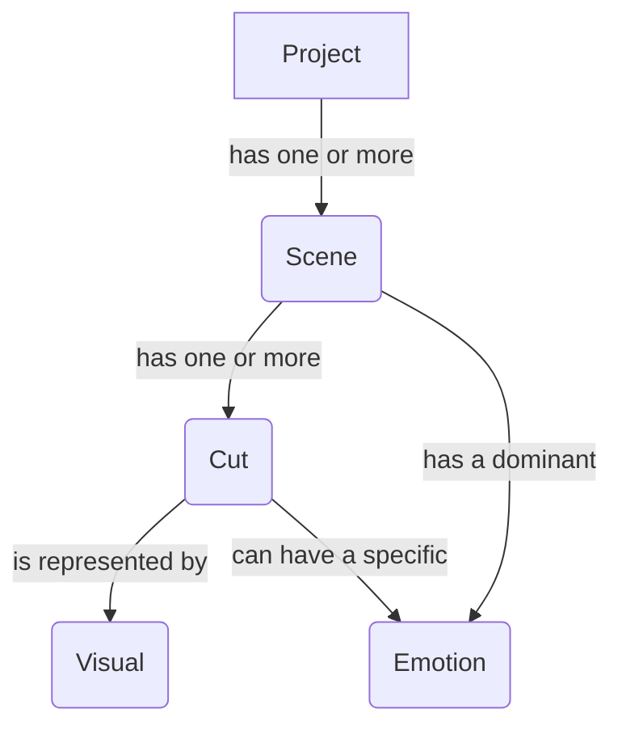

# 3. Entity-Relationship Ontology

This document defines the relationships between the core data entities in the STUDIO TALOS pipeline.

## Core Entities
- **Project:** The root entity, representing a single animated work.
- **Scene:** A segment of the Project with a consistent location and time.
- **Cut:** A single, continuous shot within a Scene.
- **Emotion:** A descriptive tag for the emotional tone.
- **Visual:** A generated image representing a Cut.

## Relationship Graph

## Description of Relationships

- A **Project** contains one or more **Scenes**.
- A **Scene** is a child of a **Project** and contains one or more **Cuts**.
- A **Cut** is a child of a **Scene** and is represented by exactly one **Visual** (the generated cartoon image).
- Both **Scenes** and **Cuts** are associated with an **Emotion**. A Scene has a primary emotion, while individual cuts can have their own specific emotional nuances.
- The `emotion_curve.csv` file provides a time-series mapping of these emotional relationships.
