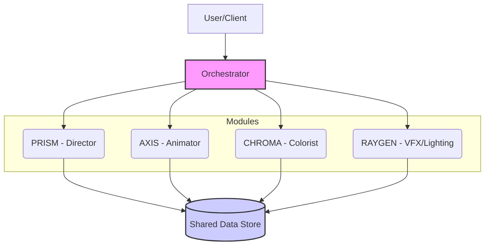

# TALOS 시스템 아키텍처 및 워크플로우

## 1. 개요

### 1.1. 시스템 목표

TALOS는 '의도(Intent)'를 입력받아 '제어 가능한(Controllable)' 애니메이션을 창작하는 것을 목표로 하는 AI 기반 자동화 파이프라인 시스템입니다. 사용자는 텍스트 프롬프트나 스타일 프로필 같은 상위 레벨의 입력을 통해 복잡한 애니메이션 제작 과정을 제어할 수 있습니다.

### 1.2. 핵심 철학

TALOS는 **'창작의 물리학(Physics of Creation)'** 철학을 기반으로 합니다. 이는 AI의 창작 과정을 예측 불가능한 확률적 '생성(Generation)'에서, 수학적 함수에 기반한 결정론적 '계산(Computation)'으로 전환하는 것을 의미합니다. 이를 통해 결과물의 모든 요소를 파라미터 단위로 제어하고, 수정하며, 재현할 수 있는 시스템을 구축합니다.

## 2. 시스템 아키텍처 (System Architecture)

TALOS는 마이크로서비스 아키텍처(MSA)와 유사한 모듈식 구조를 가집니다. 각 모듈은 특정 역할을 수행하며, `Orchestrator`에 의해 조율됩니다.

### 2.1. 컴포넌트 다이어그램



- **User/Client**: 애니메이터, 감독 등 시스템 사용자의 인터페이스 (웹 UI, CLI, 스크립트 등).
- **Orchestrator**: 모든 작업을 총괄하고, 모듈 간의 데이터 흐름을 조율하는 중앙 관제 시스템. API 서버 역할을 수행하며 작업의 상태를 관리합니다.
- **PRISM (연출 감독)**: 텍스트 프롬프트로부터 컷의 구성, 카메라 워크, 감정 곡선을 설계하여 `cut_spec.json`을 생성합니다.
- **AXIS (원화가/애니메이터)**: `cut_spec.json`을 바탕으로 3D 공간에 벡터 라인(`lines.json`)을 그립니다.
- **CHROMA (채색가)**: `lines.json`의 레이어와 스타일에 따라 색을 입힙니다.
- **RAYGEN (조명/특수효과 감독)**: 최종 장면에 영화적 조명과 시각 효과를 추가합니다.
- **Shared Data Store**: 모든 중간/최종 산출물(JSON, 비디오, 이미지 등)이 저장되는 중앙 저장소 (예: AWS S3, Google Cloud Storage).

## 3. 주요 유즈케이스 (Key Use Cases)

### 유즈케이스 1: 프롬프트 기반 전체 애니메이션 생성
- **사용자**: 감독/애니메이터
- **시나리오**: "푸른 용 두 마리가 밤의 도시 상공에서 불을 뿜으며 싸우는 10초짜리 클립"과 같은 텍스트 프롬프트를 입력하여, 완전한 스타일의 애니메이션 클립을 생성합니다.
- **흐름**: 사용자 → Orchestrator → PRISM → AXIS → CHROMA → RAYGEN → 최종 결과물

### 유즈케이스 2: 기존 작화에 다른 스타일 적용 (재채색)
- **사용자**: 아티스트
- **시나리오**: AXIS가 생성한 `lines.json` 파일에, '지브리 스타일' 대신 '사이버펑크 네온 스타일' 색상 프로필을 적용하여 결과물만 다시 렌더링합니다.
- **흐름**: 사용자 → Orchestrator → CHROMA (기존 lines.json 사용) → RAYGEN → 최종 결과물

### 유즈케이스 3: 특정 프레임 라인 수정 (향후 고급 기능)
- **사용자**: 애니메이터
- **시나리오**: AXIS가 그린 특정 프레임의 캐릭터 눈썹 라인이 마음에 들지 않아, 해당 라인의 곡률 파라미터를 수동으로 조절하고 해당 프레임만 다시 렌더링하여 확인합니다.
- **흐름**: 사용자 ↔ AXIS (특정 라인 수정 API 호출)

## 4. 엔드투엔드 워크플로우 상세 (End-to-End Workflow)

'유즈케이스 1'을 기준으로, 시스템 내부의 상세한 작동 순서는 다음과 같습니다.

1.  **Job Submission**: 사용자가 `Orchestrator`의 `POST /jobs` API에 프롬프트를 담아 요청을 보냅니다. `Orchestrator`는 고유 `job_id`를 생성하고 작업 상태를 `pending`으로 설정합니다.
2.  **PRISM - Directing**: `Orchestrator`가 `PRISM` 모듈을 호출합니다. `PRISM`은 프롬프트를 해석하여 `cut_spec.json` 파일을 생성하고, 이를 `Shared Data Store`의 `/{job_id}/prism/` 경로에 저장합니다.
3.  **PRISM Callback**: `PRISM`은 작업 완료 후 `Orchestrator`의 `POST /callbacks/job-completed` API를 호출하여, 자신의 작업 완료 상태와 결과물 URL을 알립니다.
4.  **AXIS - Animation**: `Orchestrator`는 `PRISM` 작업 완료를 확인하고, `AXIS` 모듈의 `POST /generate` API를 호출합니다. 이때 `cut_spec.json`의 URL을 함께 전달합니다.
5.  **AXIS Processing**: `AXIS`는 `cut_spec.json`을 바탕으로 3D 검증 파이프라인을 실행하여 `lines.json` 파일을 생성하고, 이를 `Shared Data Store`의 `/{job_id}/axis/` 경로에 저장합니다.
6.  **AXIS Callback**: `AXIS`는 작업 완료 후 `Orchestrator`에 콜백을 보냅니다.
7.  **CHROMA - Coloring**: `Orchestrator`는 `AXIS` 작업 완료를 확인하고, `CHROMA` 모듈의 `POST /colorize` API를 호출합니다. 이때 `lines.json`의 URL과 스타일 프로필 정보를 전달합니다.
8.  **CHROMA Processing**: `CHROMA`는 `lines.json`의 레이어 정보를 바탕으로 각 영역에 색을 입혀, 프레임별 이미지(`png` 시퀀스)를 생성하고 `/{job_id}/chroma/` 경로에 저장합니다.
9.  **CHROMA Callback**: `CHROMA`는 작업 완료 후 `Orchestrator`에 콜백을 보냅니다.
10. **Job Completion**: (RAYGEN 단계를 생략할 경우) `Orchestrator`는 `CHROMA`의 이미지 시퀀스를 비디오 인코더로 보내 최종 `video.mp4` 파일을 생성합니다. 작업 상태를 `completed`로 변경하고, 최종 결과물의 URL을 사용자에게 제공합니다.

## 5. 데이터 흐름 요약 (Data Flow Summary)

```
Input: Prompt
   ↓
[ PRISM ]
   ↓
Output: cut_spec.json
--------------------------------------
Input: cut_spec.json, source_video.mp4
   ↓
[ AXIS ]
   ↓
Output: lines.json
--------------------------------------
Input: lines.json, style_profile.json
   ↓
[ CHROMA ]
   ↓
Output: frame_0001.png, frame_0002.png, ...
--------------------------------------
Input: frame_xxxx.png
   ↓
[ RAYGEN / Encoder ]
   ↓
Output: final_video.mp4
```
